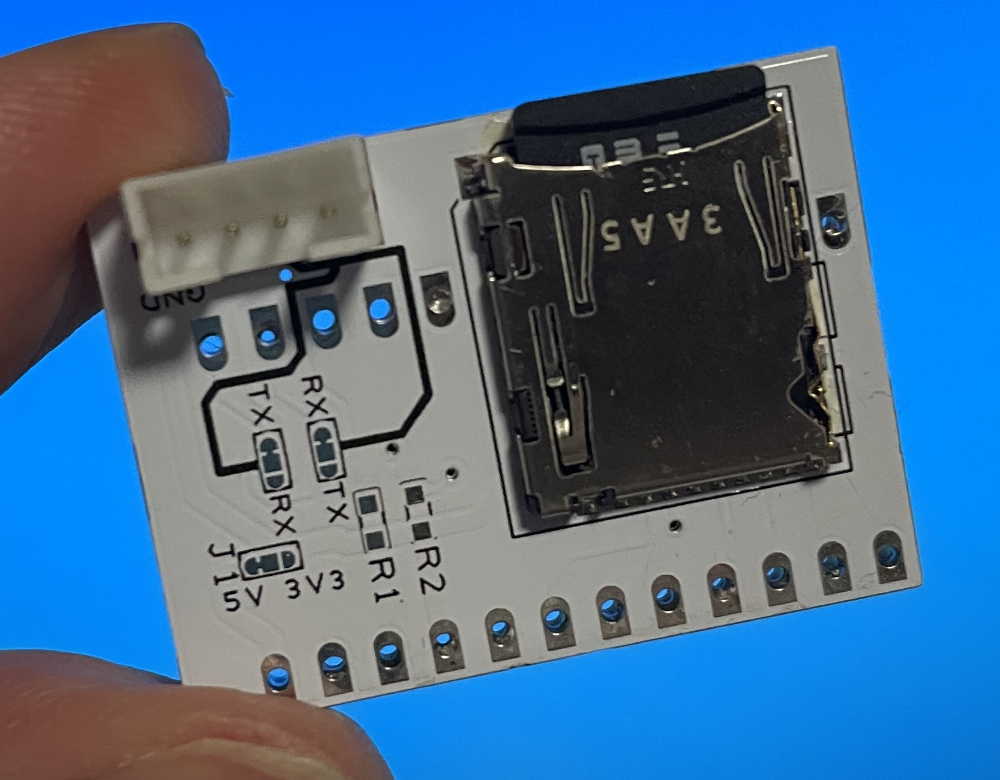
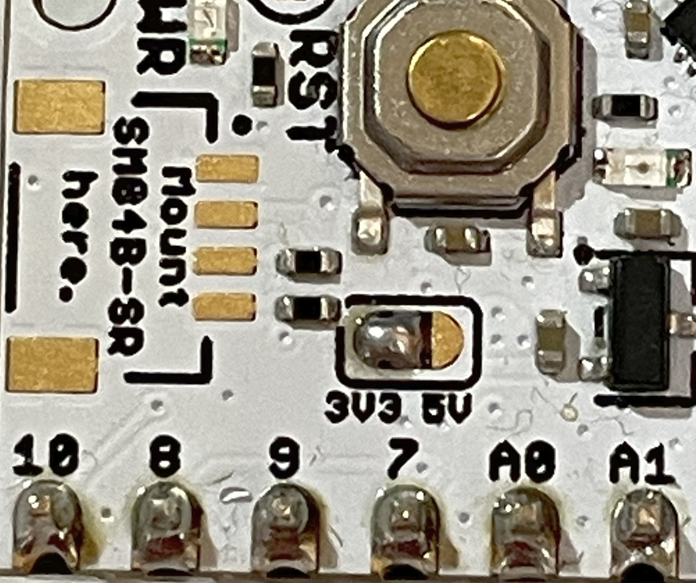

# SDLog for UIAPduino

UIAPduino (CH32V003) 用の OpenLog 互換 UART データロガーです。  
UART RX で受信したデータを microSD カードに記録します。

このスケッチは、UIAPduino をベースにした専用ロギングボード **UIAP LOG** 向けに開発されました。

| 表面 | 裏面 |
|------|------|
|  |  |

> X にて公開: https://x.com/momoonga/status/2057563370535223761

---

## 必要なもの

### UIAPduino HID ボードパッケージ

このスケッチは **UIAPduino HID** ボードパッケージに最適化されており、CH32V003 の 16 KB Flash に収まるサイズのバイナリを生成できます。

1. Arduino IDE を開き、**ファイル > 環境設定** を開く
2. 「追加のボードマネージャのURL」に以下を追加:
   ```
   https://github.com/tarosay/board_manager_files/raw/main/package_uiap_hid_index.json
   ```
3. **ツール > ボード > ボードマネージャ** を開き、`UIAPduino` で検索して **UIAPduino HID** をインストール

### Arduino IDE 設定

| 設定 | 値 |
|------|-----|
| ボード | `ツール > ボード > UIAP_HID > HID ProMicro CH32V003` |
| USB | `ツール > USB > No USB (SD log / UART only)` |
| FQBN | `UIAP_HID:ch32v:CH32V003:usb=nousb,opt=oslto` |

---

## 配線

> ⚠️ **重要**: microSD カードは 3.3V 動作です。使用前に UIAPduino の電源を 5V から 3.3V にパターンカットで切り替えてください。5V のまま接続すると SD カードが破損します。



| UIAPduino | microSD アダプタ |
|-----------|----------------|
| A2 (PC4, pin 6) | CS (DAT3) |
| 8 (PC6) | MOSI (CMD / DI) |
| 7 (PC5) | SCK (CLK) |
| 9 (PC7) | MISO (DAT0 / DO) |
| 3V3 | VDD |
| GND | VSS |

**UART（データ入力）:**
- `RX  PD6` — ログ対象機器の TX に接続
- `TX  PD5` — ロギングには使用しない

---

## 使い方

### ログファイル

電源投入ごとに新しいログファイルが作成されます:  
`LOG00001.TXT`, `LOG00002.TXT`, ...

### ボーレート（CONFIG.TXT）

SD カードに `CONFIG.TXT` を置くとボーレートを設定できます。  
形式: `9600,26,3,0`（先頭の値のみ使用）

ファイルが存在しない場合は 9600 bps で動作し、`CONFIG.TXT` が自動作成されます。  
300 bps 以上のボーレートを指定できます。

### LED 動作

| LED | 意味 |
|-----|------|
| 高速点滅 | エラー（SD 初期化失敗、ログファイル作成不可など） |
| 点滅 | SD へのデータ書き込み中 |
| 点灯または消灯 | データ待機中 |

---

## ライセンス

MIT

---

## English

OpenLog-compatible UART data logger for UIAPduino (CH32V003).  
Receives data on UART RX and writes it to a microSD card.

This sketch was developed for the **UIAP LOG** board, a dedicated logging board based on UIAPduino.

### Requirements

#### UIAPduino HID board package

This sketch is optimized for the **UIAPduino HID** board package, which produces binaries small enough to fit in the CH32V003's 16 KB Flash.

1. Open Arduino IDE and go to **File > Preferences**
2. Add the following URL to **Additional boards manager URLs**:
   ```
   https://github.com/tarosay/board_manager_files/raw/main/package_uiap_hid_index.json
   ```
3. Open **Tools > Board > Boards Manager**, search for `UIAPduino`, and install **UIAPduino HID**

#### Arduino IDE settings

| Setting | Value |
|---------|-------|
| Board | `Tools > Board > UIAP_HID > HID ProMicro CH32V003` |
| USB | `Tools > USB > No USB (SD log / UART only)` |
| FQBN | `UIAP_HID:ch32v:CH32V003:usb=nousb,opt=oslto` |

### Wiring

> ⚠️ **Important**: The microSD card operates at 3.3V. Cut the power pattern on UIAPduino to switch from 5V to 3.3V before use. Connecting at 5V may damage the SD card.


| UIAPduino | microSD adapter |
|-----------|----------------|
| A2 (PC4, pin 6) | CS (DAT3) |
| 8 (PC6) | MOSI (CMD / DI) |
| 7 (PC5) | SCK (CLK) |
| 9 (PC7) | MISO (DAT0 / DO) |
| 3V3 | VDD |
| GND | VSS |

**UART (data input):**
- `RX  PD6` — connect to TX of the device to be logged
- `TX  PD5` — not used for logging

### Usage

#### Log files

A new log file is created on every power cycle:  
`LOG00001.TXT`, `LOG00002.TXT`, ...

#### Baud rate (CONFIG.TXT)

Place `CONFIG.TXT` on the SD card to set the baud rate.  
Format: `9600,26,3,0` (only the first value is used)

If the file does not exist, 9600 bps is used and `CONFIG.TXT` is created automatically.  
Baud rates of 300 bps or higher can be specified.

#### LED behavior

| LED | Meaning |
|-----|---------|
| Fast blink | Error (SD init failed, cannot create log file, etc.) |
| Blink | Writing data to SD |
| Steady | Waiting for data |

### License

MIT
